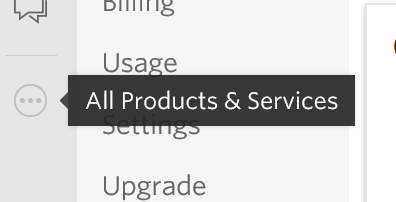
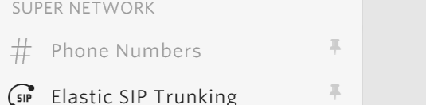
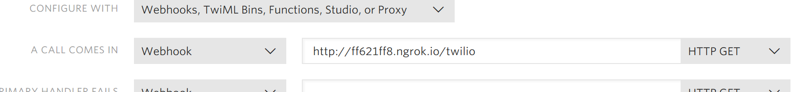

# Twilio Note Taker App #

This is a simple Twilio app written in Python 3.6 that answers an inbound voice call, records the message and then transcribes that message and sends the transcription back as text message to the caller.

The idea is to be able to quickly take notes by just calling a number from your SMS enabled device.

Specifically things like shopping lists:

* Oranges
* Apples
* Bananas
* etc...

In reality this app really evaluates different trascriptions services

Currently Google and IBM Watson

## Requirements ##

Python 3.6.x 

See [_requirments.txt_](./requirements.txt) for Python Packages

These can be bulk installed running the command

```bash
pip install -r ./requirements.txt
```

From the locally cloned directory

Make sure you have appropriate credentials for the the following services

* [Twilio](http://www.twilio.com)
* [Google Cloud](https://cloud.google.com/speech-to-text)
* [IBM Watson](https://www.ibm.com/watson/services/speech-to-text)

The following Envrionment variables are required for authentication

|Variable|
|--- |
|TWILIO_ACCOUNT_SID|
|TWILIO_AUTH_TOKEN|
|WATSON_USERNAME|
|WATSON_PASSWORD|
|GOOGLE_DEVELOPER_KEY|
| |

## Running the App ##

With the authentication environment variables setup, the app can be run by simply issueing the command

```bash
python ./server.py
```

This will bind the app to `localhost` on port `8080`

This can be changed by adding the following two envrionment varables:

|Variable|
|---|
|NOTE_TAKER_HOST|
|NOTE_TAKER_PORT|
| |

The `NOTE_TAKER_HOST` can be either a hostname or ip address.

It is required that this app is accessable from the Twilio domain. Which means that the app needs to be on a public network.  This can be achieve locally by using a service like [_ngrok_](https://ngrok.com/).

Log into the [Twilio console](https://www.twilio.com/console) and select `All Products & Services` on the left hand side.



Then select `Phone Numbers`



Either select and existing phone number, or create a new number.  Make sure it has both **VOICE** and **SMS**

 In the `VOICE & FAX` section add the URL to your app as a **Webhook** in the `A CALL COMES IN` input.  In the example I am using the aforementioned [_ngrok_](https://ngrok.com/).



Make sure the URL references the `/twilio` path.

Save the configurataion.

With the app running, call the number associated with this app.  You will want to call the App from an SMS enabled phone since the app will use the caller number to send the SMS.

## NOTES ##

This is sample code and a proof of concept, will be happy to talk about the code, but it is not actively supported.

Improvements:

* Asyncronous calls to transcription methods
* Handle multiple calls at a time (not tested that is can)
* Error handling
* Proper logging
* Amazon AWS Transcription (current limitation is that it needs to be uploaded to S3)
* Twilio Transcription
* Microsoft Transcription?
* Other Transcription?
* Run as serverless _(I have tried to run this in AWS Lambda using API Gateway, but the Google client libraries won't install in Lambda and I did not persue further)_

Deprcated:
Deepgram no longer has an open API for developers and has been removed from this codebase.
